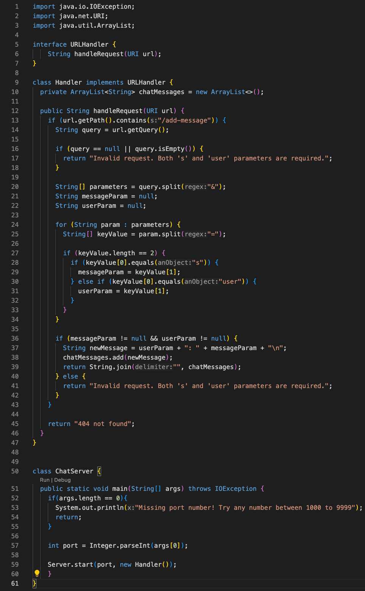
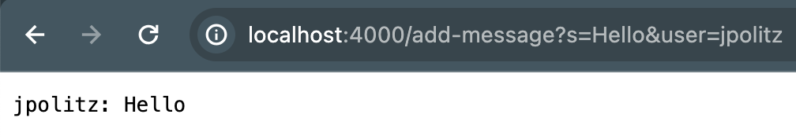
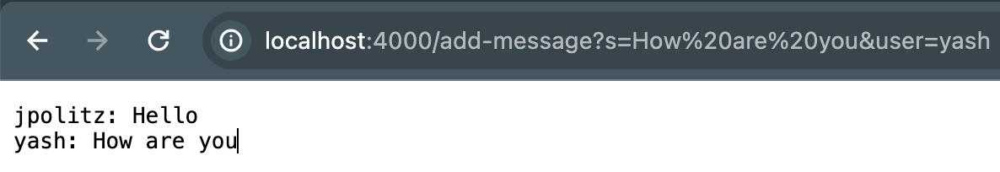
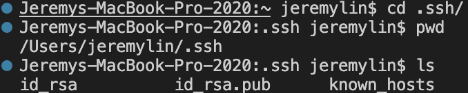
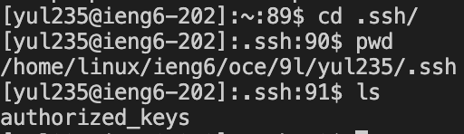
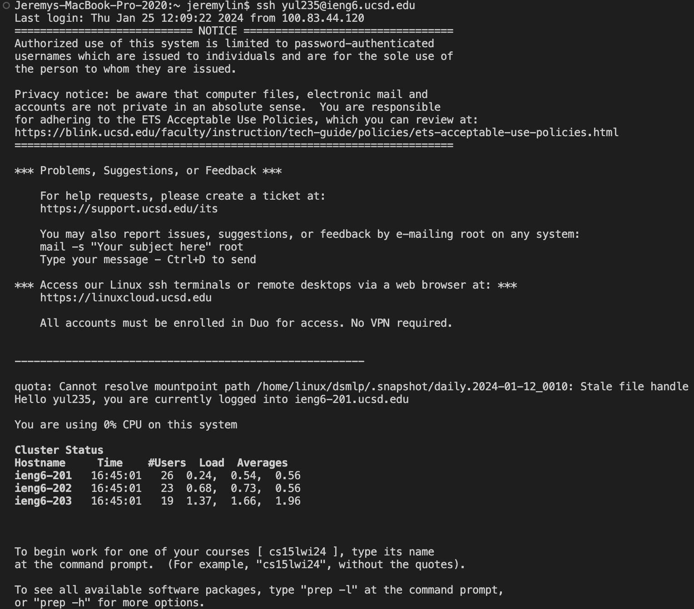

<h1><italic>CSE 15L Lab 2 Report</italic></h1>

<h3>Part 1</h3>

- Chatserver code:

- Running code the first time:

- When I run `add-message?s=Hello&user=jpolitz`, the method handelRequest of the Handle class is called. Then, it extracts the URL and stores it in the `chatMessages` ArrayList.
- This method takes in a variable URI, called `url`. Then it will extract two values called messageParam and userParam and store them in the `chatMessages` ArrayList.
- The method could change the `chatMessages` ArrayList. For this command, it will extract Hello and jpolitz and put them into a new message, and then store them into the ArrayList.

---

- Running code the second time:

- When I run `add-message?s=How%20are%20you&user=yash`, the method handelRequest will run again as I described above.
- This method takes in a variable URI, called `url`. Then it will be split into separate parts and only take the String we need.
- The method changes the `chatMessages` ArrayList again. For this, it will extract How are you and yash, and put them into a new message, and then store them into the ArrayList.

---

<h3>Part 2</h3>

- The absolute path to the private key for your SSH key for logging into `ieng6`

- The absolute path to the public key for your SSH key for logging into `ieng6`

- A terminal interaction where you log into your ieng6 account without being asked for a password

---

<h3>Part 3</h3>

- In these two weeks, one thing I learned that I never knew before is the two commands in the terminal, which are  `mkdir` and  `scp`. These two commands create the respiratory and upload files from the local to the remote server. This is much easier than `push` the file onto GitHub and `clone` it from the server.
