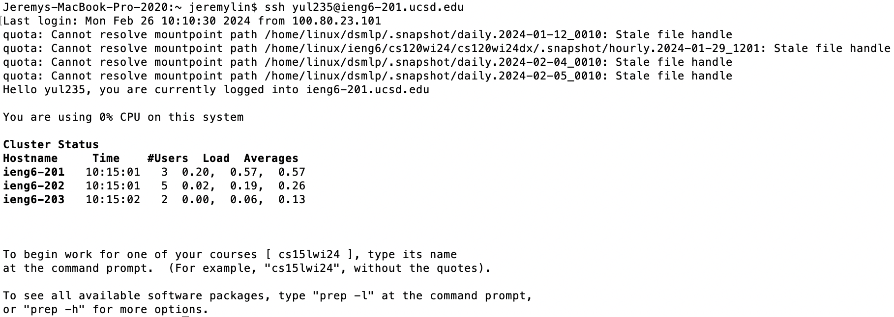
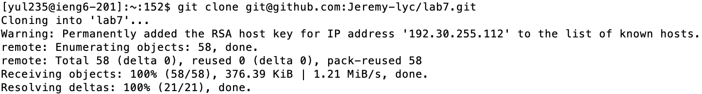
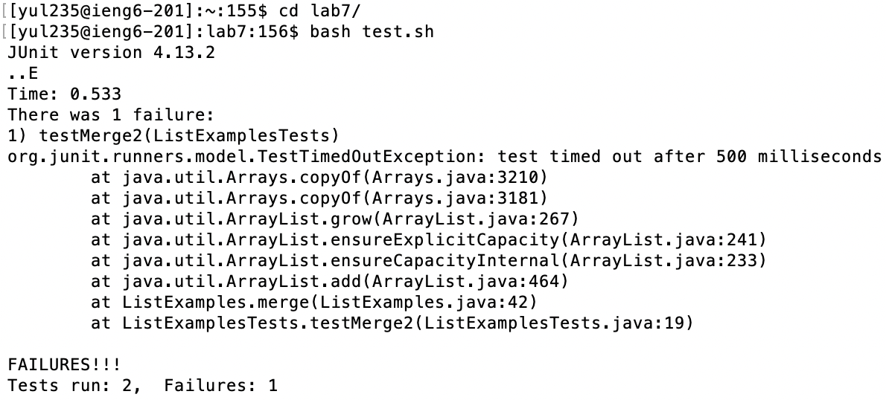

<h1>CSE 15L Lab Report 4</h1> 

<h3>Step 4: Log into ieng6</h3>

- Key pressed: `ssh yul235@ieng6-201.ucsd.edu`
- This step is to log into the server. Because I have set up the key in the server, I do not need to type in the password to log in.

---

<h3>Step 5: Clone your fork of the repository from your GitHub account (using the `SSH` URL)</h3>

- Key pressed: `git clone git@github.com:Jeremy-lyc/lab7.git`
- This step is to clone the repository from GitHub to local. Because we are using the `SSH` address, we could easily commit and push the changes to the cloud.

---

<h3>Step 6: Run the tests, demonstrating that they fail</h3>

- Key pressed: `cd lab7/` ➡️ `bash test.sh`
- First, I navigate into the correct repository using `cd lab7/`, and then I run the corresponding tests by running this `test.sh` bash script. In the bash script, it compiles all the files in this repository and run the corresponding test.
