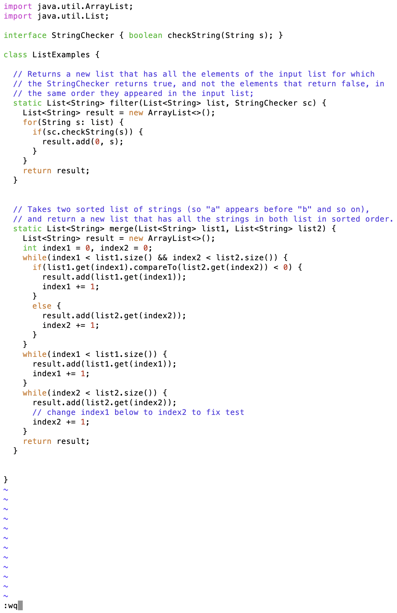
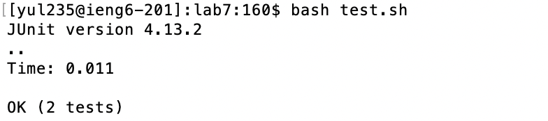
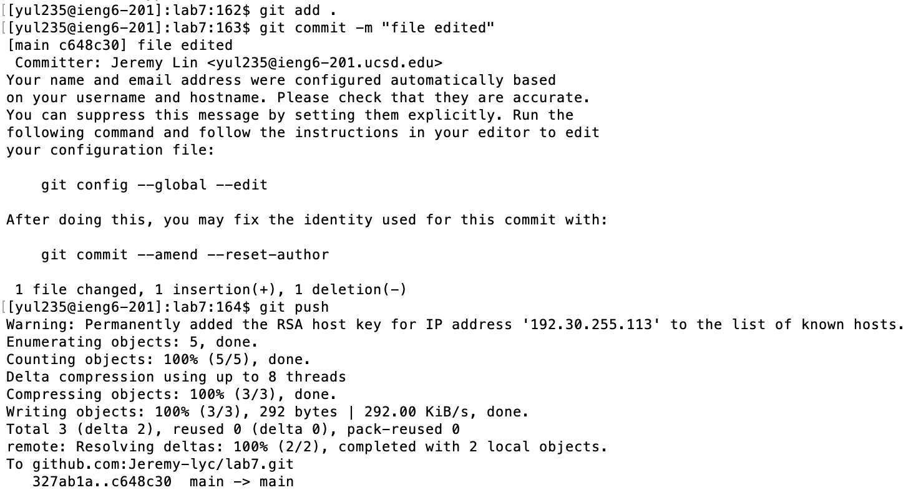

<h1>CSE 15L Lab Report 4</h1> 

<h3>Step 4: Log into ieng6</h3>

- Key pressed: `ssh yul235@ieng6-201.ucsd.edu`
- This step is to log into the server. Because I have set up the key in the server, I do not need to type in the password to log in.

---

<h3>Step 5: Clone your fork of the repository from your GitHub account (using the `SSH` URL)</h3>

- Key pressed: `git clone git@github.com:Jeremy-lyc/lab7.git`
- This step is to clone the repository from GitHub to local. Because we are using the `SSH` address, we could easily commit and push the changes to the cloud.

---

<h3>Step 6: Run the tests, demonstrating that they fail</h3>

- Key pressed: `cd lab7/` ➡️ `bash test.sh`
- First, I navigate into the correct repository using `cd lab7/`, and then I run the corresponding tests by running this `test.sh` bash script. In the bash script, it compiles all the files in this repository and runs the corresponding test.

---

<h3>Step 7: Edit the code file to fix the failing test</h3>

- Key pressed: `vim ListExamples.java` ➡️ `<shift + g><6k><12l><i><delete><2><esc><:wq>`
- First, I used `vim` to enter the editor mode to edit this java file. Then, I used `shift` + `g` to navigate to the last line of this file. After this step, I used `6k` and `12l` to move to the correct place. `6k` means moving 6 lines up, and `12l` means moving 12 spaces to the left. Then, I used `i` to enter the insert mode, and I performed the necessary changes to this file. Then I used `esc` to exit the insert mode, and use `:wq` to save this file.

---

<h3>Step 8: Run the tests, demonstrating that they now succeed</h3>

- Key pressed `bash test.sh`
- This step is to rerun the bash script to make sure the edit I did is correct and meets my expectations.

---

<h3>Step 9: Commit and push the resulting change to your GitHub account</h3>

- Key pressed: `git add .` ➡️ `git commit -m "file edited"` ➡️ `git push`
- First I performed `git add .`, this means that add all changes in the current directory and its subdirectories to the staging area, and the only change I made was to the ListExamples.java file. Then, I did `git commit -m "file edited"`, which means that I saved this file and wrote a message to it. Finally, I used `git push` to push these changes to the cloud.
