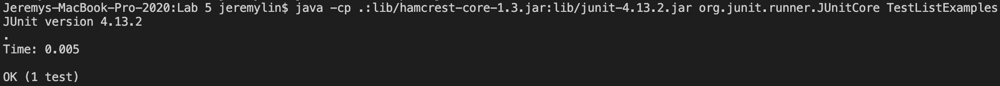

<h1>CSE 15L Lab Report 5</h1>

**Student**: I was wondering why I keep getting this error for error out of bounds, and I couldn't figure it out.


**TA**: It looks like your merge method is having a problem with adding them to the list, can you take a look into the list and see if there might be some errors when you add the element to the corresponding list?

**Student**: Ah, I see where the problem is, and I fixed it. It's when I try to compare the result and add the corresponding element into the list, I messed up the results of compareTo.



---

- The two files that are needed for this are `list-example.java` and `TestListExamples.java`
- `list-example.java` code

```
import java.util.ArrayList;
import java.util.List;

interface StringChecker { boolean checkString(String s); }

class ListExamples {

  static List<String> filter(List<String> list, StringChecker sc) {
    List<String> result = new ArrayList<>();
    for(String s: list) {
      if(sc.checkString(s)) {
        result.add(s);
      }
    }
    return result;
  }

  static List<String> merge(List<String> list1, List<String> list2) {
    List<String> result = new ArrayList<>();
    int index1 = 0, index2 = 0;
    while(index1 < list1.size() && index2 < list2.size()) {
      if(list1.get(index1).compareTo(list2.get(index2)) < 0) {
        result.add(list2.get(index1));
        index1 += 1;
      }
      else {
        result.add(list1.get(index2));
        index2 += 1;
      }
    }
    while(index1 < list1.size()) {
      result.add(list1.get(index1));
      index1 += 1;
    }
    while(index2 < list2.size()) {
      result.add(list2.get(index2));
      index2 += 1;
    }
    return result;
  }
}
```

- `TestListExamples.java` code

```
import static org.junit.Assert.*;
import org.junit.*;
import java.util.Arrays;
import java.util.List;


public class TestListExamples {
  @Test
  public void testMergeRightEnd() {
    List<String> left = Arrays.asList("a", "b", "c");
    List<String> right = Arrays.asList("a", "d");
    List<String> merged = ListExamples.merge(left, right);
    List<String> expected = Arrays.asList("a", "a", "b", "c", "d");
    assertEquals(expected, merged);
  }
}
```

- The command that triggers the error is when I call the `merge` method for two lists.
- The way to fix this is to after comparing the elements in two lists if the element in `list1` is smaller than `list2`, we should add the `list1` element into the list rather than the `list2` element.

---

